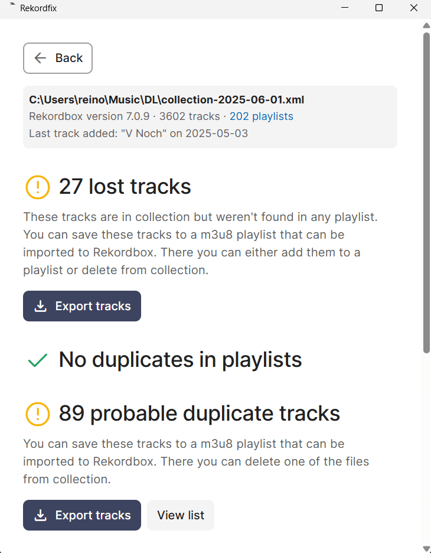

# Rekordfix

Small utility to add workarounds for missing Rekordbox features. Tested and developed on Windows, builds are provided for Mac and Linux as well.

- Find tracks from a Rekordbox collection that aren't in any playlists
- Find duplicate tracks in playlists
- Find probable duplicates from collection
- Interface to delete/restore track files from disk that have been removed from collection

